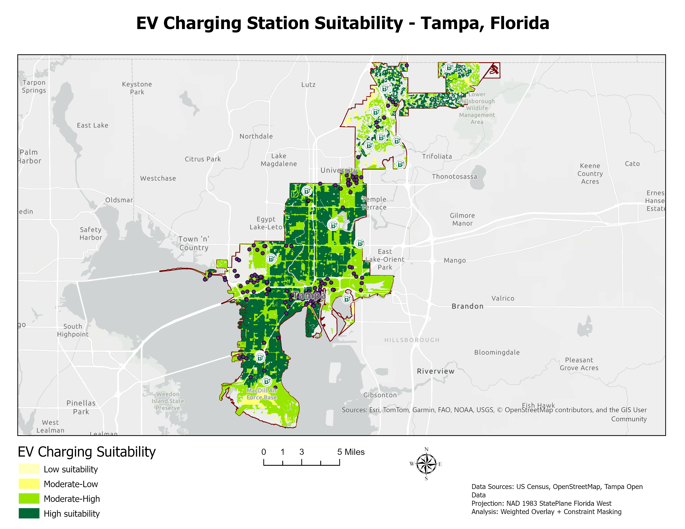
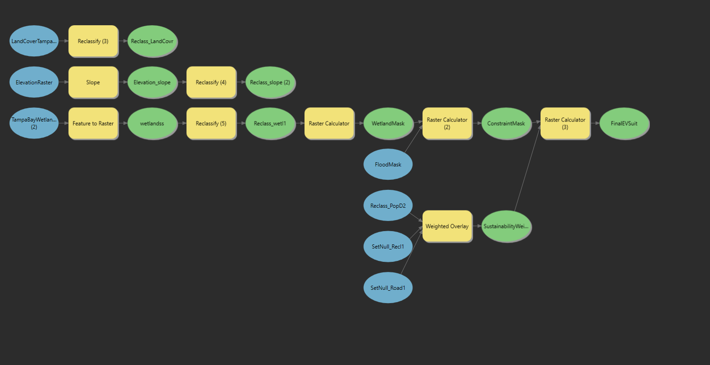
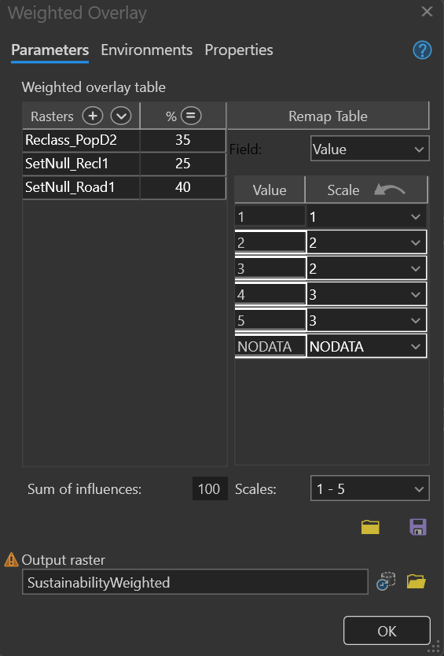

# EV Charging Station Suitability Analysis – Tampa, Florida

## Overview

This project identifies optimal locations for EV charging stations using GIS-based multi-criteria analysis. It integrates accessibility, population demand, land suitability, and environmental constraints.

## Methods

* Raster reclassification (1–5 scale)
* Weighted overlay analysis
* Constraint masking (flood zones + wetlands)
* Euclidean distance (road accessibility)
* ModelBuilder workflow automation

## Data Sources

* US Census (ACS)
* OpenStreetMap
* FEMA Flood Zones
* National Wetlands Inventory
* Tampa Open Data

## Results

* Identified high-suitability zones near major corridors (I-275, I-4)
* Highlighted underserved regions in northern and eastern Tampa
* Avoided environmentally sensitive and flood-prone areas

## Tools Used

* ArcGIS Pro
* ModelBuilder
* Spatial Analyst

## Outputs

* Final suitability map
* ModelBuilder workflow
* Technical report

## Map Output

## Model Workflow

## Weighted Overlay Setup

